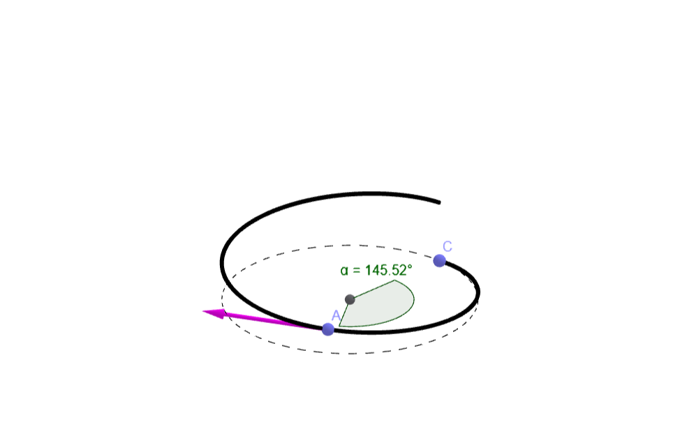
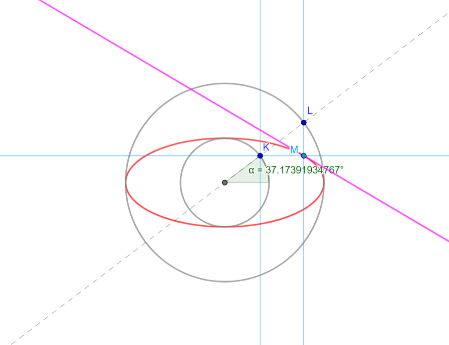

# Curves3D

## About
This is test assignment on some curves in R3: circle/ellipse/helix.

## Documentation
/docs directory contains math models in GeoGebra/Mathcad as well as some study material.

## Build
Visual Studio 2022/C++20

